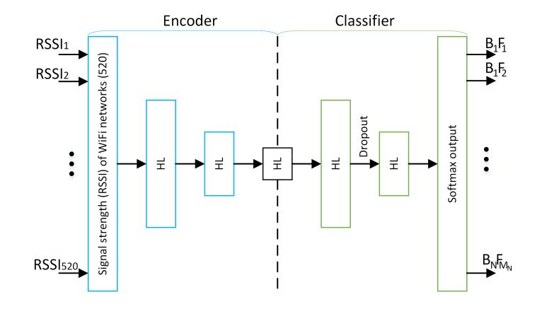

This is a repository for research on indoor localization based on wireless fingerprinting techniques.

# Building/Floor Classification and Location Estimation using Wi-Fi Fingerprinting

## Intorduction
 - **Background**
 
   The most widely used positioning system is global positioning system (GPS). However, the radio signals of satellites are too weak to penetrate buildings and walls, thus GPS is not applicable in indoor environment.
 - **Indoor localization**
 
   Typical indoor localization algorithms mainly include trilateration or triangulation and maximum likelihood techniques. The common ranging methods are as follows: Time of Arrival (TOA), Time Difference of Arrival (TDOA), Angle of Arrival (AOA) and Received Signal Strength Indicator (RSSI) ranging method.
 - **Received signal strengths (RSS)**

   Due to complex indoor environment and the limits of access points (APs), the positioning technology of (RSSI) is the main technology of WiFi localization.
 - **Problems**
 
   Due to complex indoor environment, RSSs are easily affected by multipath effect, cofrequency radio interference, the absorption of human body and other ambient changes. Therefore, RSSs fluctuate with time even at a fixed location, which causes inaccurate positioning results. Meanwhile, the positions estimated by WiFi fingerprinting method are independent and discontinuous in real-time tracking.

## Methodology
**1. Experimental Data**

- UJIIndoorLoc dataset
- Total 19937 samples separated in training, validation, and test data.
- Each scan in the database contains 529 attributes. 

There are 520 different APs were discovered and therefore the first 520 attributes inform about the received signal strength of those networks. The signal strengths vary from -110 dBm in a case of poor reception. The remaining 9 attributes contain information about longitude and latitude of measurement, floor number, building ID, space ID, relative position, user ID, phone ID and the timestamp of the measurement.

**2. Stacked Auto Encoder (SAE)**

Since the DNN architecture is not optimized enough, we can use stacked auto encoders for this task and provide raw measurements at DNN input. 

Stacked auto encoders (SAE) are parts of the deep network used to reduce the dimensionality of the input data by learning the reduced representation of the original data during unsupervised training.

**3. Classification**

When the unsupervised learning of weights of SAE is finished, break the decoder part of the network and connect layers of a deep network to the output of the encoder typically and fully, that we call the classifier.

We also employ dropout between hidden layers of the classifier, which randomly drops connections between layers during training to force the network to learn redundant representation and thus achieve better generalization and avoid overfitting.

## Results

**1. The related numeric parameters**

 - GPU ID: 0
 - Random seed: 0
 - Epochs: 20
 - Batch size: 10
 - Training validation test ratio: 7:2:1
 - SAE hidden layers: 256-128-64-128-512
 - Classifier hidden layers: 128-256-512
 - Dropout: 0.2

 
   The accurace is about 59.23%.

**2. The different accuracy after change the parameters**

 - only change the SAE hidden layers from 256-128-64-128-256 to 256-128-64-16-64-128-256

The accuracy declined from 59.23% to 39.35%.

 - only change the classifier hidden layer from 128-256-512 to 128-128-128

The accuracy declined from 59.23% to 50.96%.

 - only change the training-validation-testing ratio from 7:2:1 to 6:3:1

The accuracy declined from 59.23% to 55.81%.

 - only change the training-validation-testing ratio to 8:1:1

The accuracy increased from 59.23% to 61.65%.

It was increased a little and may because increase the number of training data.

 - increase the number of epochs to 25 with ratio as 8:1:1

The accuracy increased from 61.65% to 62.45%.

So increase the number of epochs can increase the accuracy slightly.

 - change the dropout from 0.2 to 0.3 with ratio as 8:1:1

The accuracy declined from 61.65% to 47.60%.

 - change the dropout from 0.2 to 0.3 with ratio as 8:1:1

The accuracy declined from 61.65% to 0.05%.

So the most suitable dropout is 0.2.

 - change the batch size from 10 to 20 with eroph=25 and ratio as 8:1:1

The accuracy increased from 62.45% to 62.95%.

So increase the size of batch can increase the accuracy. Also, increase the size of batch can reduce the consuming time of running code.

**3. For higher accuracy**

From previous work, batch size and the number of epoch has the most impact on the accuracy. So to get higher accuracy, we need to change them to higher numbers

From the figure, we can find that as the number of epochs gets larger, the accuracy is growing. At first, the growing is fast but then becomes slow and level-off. When the size of batch become larger, the accuracy gets higher slightly.
However, if the batch size is small, when the number of epochs gets larger than a certain number, the accuracy would fall abruptly.

We can find that the highest accuracy is 74.10% with batch size = 100 and epochs number = 100.

**4. Validation accuracy**

for batch size = 20

for batch size = 50

for batch size = 100

**5. Classification parameters**

CLASSIFICATION ACTIVATION: change 'relu' to 'selu' so that cna get higher accuracy

The accuracy increased from 74.10% to 74.95%.

CLASSIFICATION LOSS: change 'categorical_crossentropy¡¯ to 'binary_crossentropy¡¯

From the figure, we can find although the accuracy can reach about 99.89%. there may be something wrong inside the code because the validation accuracy growing curve is not the same as above.

## Conclusion

In this experiment, we have introduced the feasibility study project using the UJIIndoorLoc dataset to apply indoor localization. From previous work, we can find that to get higher accuracy, we should enlarge the number of epochs and the batch size but may cost much more time. However, it is difficult to improve the accuracy because the numeric parameters can only change the accuracy slightly. So, further study is needed to change the model for more accurate building-floor-localization.

## Reference

[1] M. Nowicki and J. Wietrzykowski, "Low-effort place recognition with WiFi fingerprints using deep learning," arXiv:1611.02049v2 [cs.RO] [(arXiv)](https://arxiv.org/abs/1611.02049v2)

[2] W. K. Zegeye et al., "WiFi RSS Fingerprinting Indoor Localization for Mobile Devices," *2016 IEEE 7th Annual Ubiquitous Computing, Electronics & Mobile Communication Conference (UEMCON) Ubiquitous Computing, Electronics & Mobile Communication Conference (UEMCON), IEEE Annual*, New York City, NY, USA, Oct. 20-22 20116. [(DOI)](10.1109/UEMCON.2016.7777834)

[3] Q. LU et al., "A Hybrid Indoor Positioning Algorithm based on WiFi Fingerprinting and Pedestrian Dead Reckoning," in *2016 IEEE 27th Annual International Symposium on Personal, Indoor, and Mobile Radio Communications (PIMRC) Personal, Indoor, and Mobile Radio Communications (PIMRC), 2016 IEEE 27th Annual International Symposium on*, Valencia, Spain, Sept. 4-8 2016.[(DOI)](10.1109/PIMRC.2016.7794982)

[4] K. S. Kim et al., "Large-Scale Location-Aware Services in Access: Hierarchical Building/Floor Classification and Location Estimation using Wi-Fi Fingerprinting Based on Deep Neural Networks," arXIV:1710.00951 [cs.NI] [(arXiv)](http://arxiv.org/abs/1710.00951)

